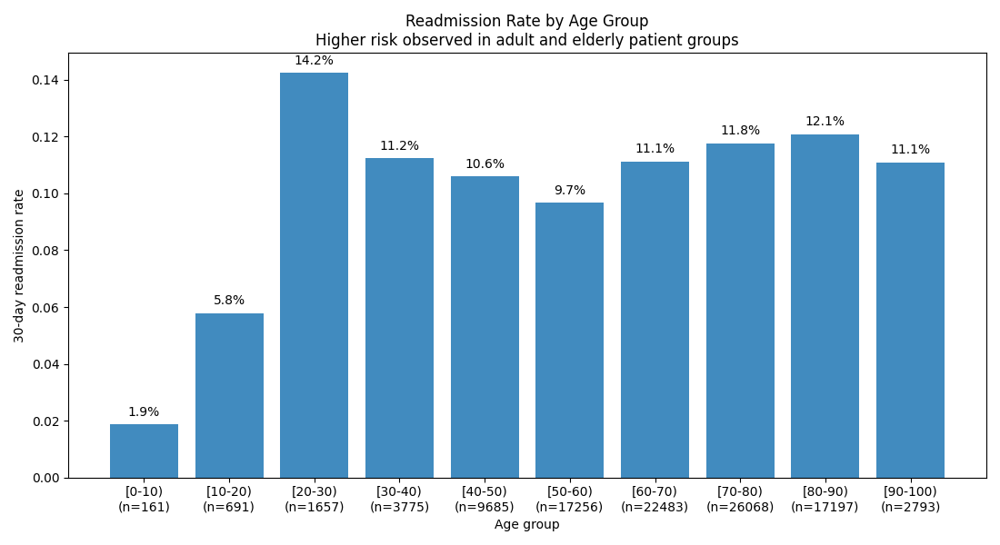
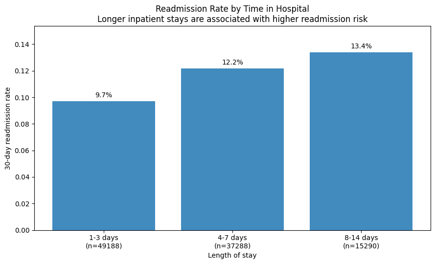
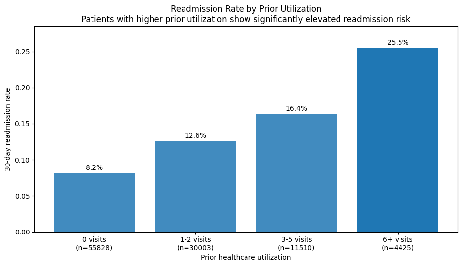
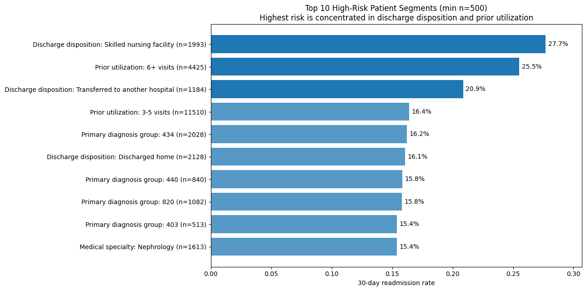

# 30-Day Readmission Risk Segmentation in US Hospitals

Built a healthcare analytics project to identify high-risk 30-day readmission segments using encounter-level hospital data, KPI reporting, and business-focused segmentation.

---

## Executive Snapshot

- Identified high-risk patient segments for 30-day hospital readmission  
- Prior utilization and discharge disposition showed the strongest impact  
- Built a segmentation framework for operational decision-making (not ML)  
- Implemented analysis in both pandas and SQL  

---

## Project Overview

This project analyzes 30-day hospital readmission risk using a large U.S. inpatient dataset.

The goal was to identify which patient and encounter segments show elevated readmission risk and translate those findings into actionable operational insights.

Unlike many projects that focus on predictive modeling, this analysis emphasizes:

- KPI definition  
- segmentation logic  
- business interpretation  

---

## Business Problem

Hospitals need to understand which patients are more likely to be readmitted within 30 days in order to:

- improve discharge planning  
- reduce unnecessary costs  
- prioritize follow-up care  
- optimize care coordination  

---

## Dataset

Source: UCI Machine Learning Repository  
Dataset: Diabetes 130-US hospitals for years 1999–2008  

The dataset contains over 100,000 inpatient encounters from 130 U.S. hospitals.

Files used:
- `diabetic_data.csv`
- `IDS_mapping.csv`

---

## Tools Used

- Python (pandas)
- SQL
- Microsoft Excel
- matplotlib
- Jupyter / Google Colab

---

## Analytical Approach

The analysis was built in structured steps:

1. Defined a 30-day readmission KPI from encounter-level data  
2. Performed data quality checks and cleaning  
3. Engineered segmentation features:
   - prior utilization  
   - time in hospital  
   - medication count  
   - diagnosis count  
4. Calculated readmission rates across segments  
5. Filtered small groups (n < 500) to ensure reliability  
6. Ranked highest-risk segments  

---

## Key Findings

- **Prior utilization is the strongest driver of readmission risk**  
  Patients with frequent prior visits (6+) show significantly higher readmission rates  

- **Discharge disposition significantly impacts outcomes**  
  Certain discharge pathways are associated with elevated risk  

- **Longer hospital stays are associated with higher readmission risk**  
  Likely reflecting greater clinical complexity  

- **Age contributes to risk but is weaker than utilization and encounter-level features**  

---

## Business Value

This analysis supports:

- prioritizing follow-up for high-risk patients  
- improving discharge planning  
- targeting care coordination efforts  
- building segmentation-driven intervention strategies  

---

## SQL Implementation

The segmentation logic was also implemented in SQL to demonstrate how the analysis would translate into a production data warehouse environment.

See:
`sql/readmission_segmentation.sql`

---

## Visuals

### Readmission Rate by Age Group

---

### Readmission Rate by Time in Hospital

---

### Readmission Rate by Prior Utilization

---

### Top 10 High-Risk Patient Segments

---

## Project Structure

healthcare-readmission-risk-segmentation/
│
├── notebooks/
│ └── readmission_risk_segmentation.ipynb
│
├── images/
│ ├── readmission_by_age_group.png
│ ├── readmission_by_stay_bucket.png
│ ├── readmission_by_prior_utilization.png
│ └── top10_high_risk_segments_improved.png
│
├── sql/
│ └── readmission_segmentation.sql
│
├── data/
│ └── data_source.txt
│
├── PROJECT_SUMMARY.md
└── README.md

## Skills Demonstrated

- SQL (CTEs, aggregations, CASE)
- Python (pandas: groupby, feature engineering)
- KPI definition and reporting
- Data cleaning and validation
- Segmentation analysis
- Data visualization
- Business interpretation

## Analytical Focus

This project demonstrates how encounter-level healthcare data can be transformed into a practical readmission risk segmentation framework.

The analysis focuses on KPI definition, segmentation logic, and translating data into operational insights.
